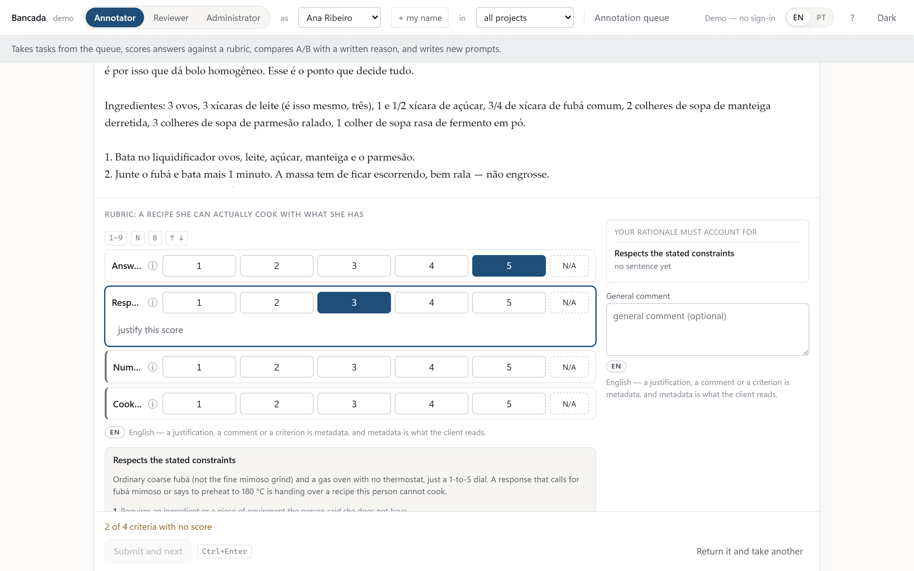
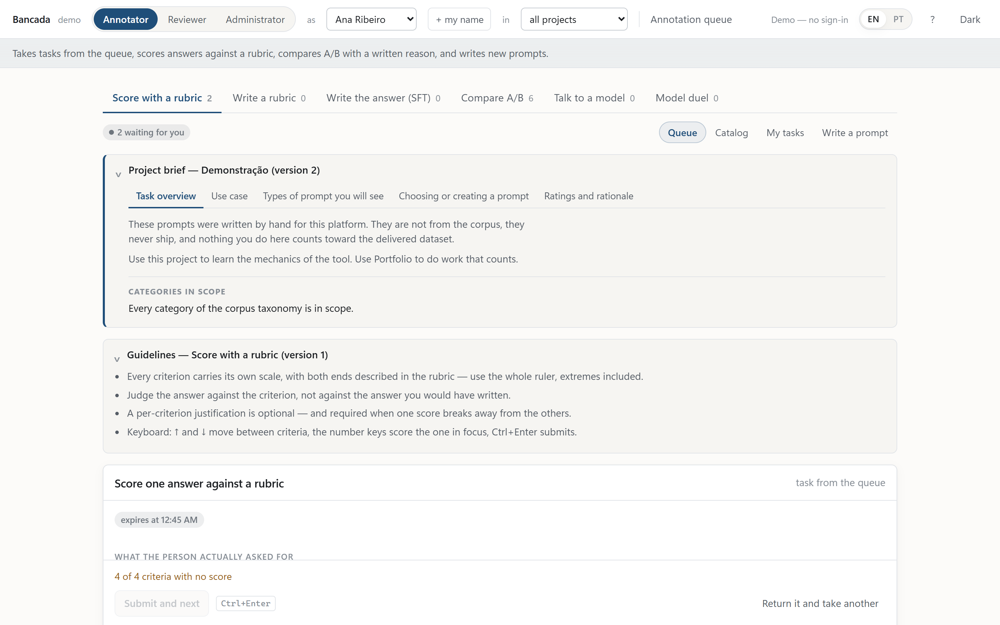
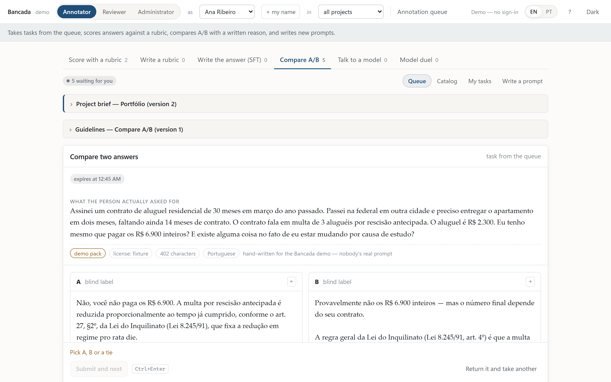
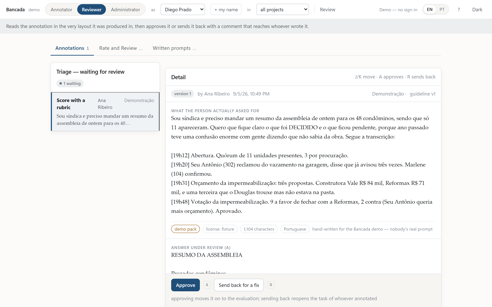
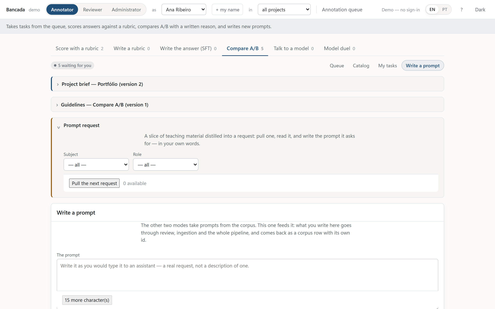

# Prompt Factory

<a href="https://github.com/geovanisdev/Prompt-factory/actions/workflows/ci.yml"></a>

> **Versão em português: [README.pt-BR.md](README.pt-BR.md).** The two files carry the same numbers, and a test in the suite fails when they drift.

A bank of **prompts written by real people** — the first user turn of conversations with LLMs, never synthetic text — in **Brazilian Portuguese and English**, deduplicated, scrubbed of PII and browsable in a local interface. It exists to curate collections and export JSONL/CSV **with licence and attribution on every row**, to feed data-annotation platforms.

And, over a sample of it, runs the **[Bancada](#the-bancada--annotation-platform)**: a complete annotation platform — three roles, six task types, two-pass QC — in which a prompt written inside the tool goes back into the corpus with a traceable licence and uid.

Everything runs **offline after ingestion**: the interface is one SQLite file plus one HTML file with no build, no framework and no reference to any external host.

```
159,733 prompts · 116,051 en · 43,682 pt · 9 open sources · 6 licences
prompts from 1 to 981,656 characters · 541 MB of text
task_type and domain on 100% of rows: 6,560 human/agent labels + an in-house classifier, with declared abstention
```


*The Bancada, annotator view: the rubric as a severity matrix — 51 px per criterion, the anchor behind ⓘ, and a rail that only unlocks once a score below the top comes with the sentence that explains it. Demonstration-pack content.*

---

## Contents

1. [What is inside](#what-is-inside) · 2. [Sources and licences](#sources-and-licences) · 3. [Installation](#installation) · 4. [Quick path (5 min)](#quick-path-5-min) · 5. [Full reproduction](#full-reproduction-from-a-clean-clone) · 6. [The interface](#the-interface) · 7. [Export](#export-and-licences) · 8. [The Bancada](#the-bancada--annotation-platform) · 9. [Milestone status](#milestone-status) · 10. [Layout](#repository-layout) · 11. [Licence](#licence)

---

## What is inside

The funnel, measured on the run that produced the current database:

| stage | rows | what dropped out |
| --- | ---: | --- |
| `data/raw/*.parquet` (9 sources) | **214,947** | — |
| s01 normalize | 214,946 | 1 `uid` repeated within the run |
| s02 language + variant | 201,704 | **13,242** that were neither pt nor en (the sources' own `language` field is often wrong) |
| s03 PII | 201,704 | nothing leaves; 2,266 rows were *rewritten* |
| s04 exact dedup | 189,087 | **12,617** byte-for-byte copies of the normalized text |
| s05 embeddings | 189,087 | — (only produces `emb/embeddings.f16.npy`) |
| s06 near dedup | **159,733** | **2,215** outside pt/en on the language recheck + **27,139** near-duplicates validated pair by pair against the canonical (cosine ≥ 0.985 **and** Jaccard ≥ 0.65 **and** length ratio ≤ 2) |

Distribution of the universe:

* **language**: en 116,051 · pt 43,682
* **pt variant**: `pt-indef` 26,600 · `pt-BR` 15,973 · `pt-PT` 1,109 — `pt-indef` is the **majority and not an error**: it means the text carries too little dialect signal to decide ("como fazer um bolo?" is neither Brazilian nor European).
* **source**: wildchat_en 67,031 · wildchat_pt 38,070 · hh_rlhf 14,878 · dolly 14,416 · no_robots 9,949 · prism 7,564 · aya 6,293 · arena140k 1,260 · oasst 272
* **5,102 rows still have an exact copy in the corpus** (`n_exact_dups > 0`): the bots that survived dedup by differing in one detail. The interface shows `×N` on them and the `max_dups=0` filter drops the whole family.
* **1,240 rows had PII replaced** with markers.
* **`task_type` and `domain` are populated** (M6/M7): 82 of the 155 batches of the labelling campaign ran (6,560 labels, mean agreement **0.913** against a hand-revised gold set) and an in-house classifier — logistic regression over the same embeddings used for dedup — covers the rest of the corpus. Macro-F1 measured on a held-out test set: **domain 0.67** (target 0.55) and **task_type 0.58** (target 0.65 — the borderline classes `outro`, `resumo` and `brainstorm` hold the mean down, and the number is documented rather than dressed up; doubling the labels moved the mean by only +0.01, so the ceiling is the recipe, not the volume). Every row declares its provenance: `label_method` (`manual`/`agent`/`classifier`), `label_confidence` and `needs_review`; below the confidence threshold the axis is **NULL — declared abstention** (12.2% of rows on task_type). `quality` and `nsfw` stay NULL on purpose: `quality` was trained, measured (0.50) and **not** applied — a plausible-but-wrong 1..3 would enter the interface's filter with nothing to flag it; `nsfw` has 18 positives in 6,560 and trains no classifier at all.

---

## Sources and licences

Every prompt carries its licence **down to the row** in the database (`license`, `commercial_ok`, `redistributable`); the attribution text comes from `config/sources.toml` at export time.

| source | dataset | language | licence | commercial | redistributable | in the universe |
| --- | --- | --- | --- | :-: | :-: | ---: |
| `wildchat_pt` | `allenai/WildChat-4.8M` | pt | ODC-BY-1.0 | yes | yes | 38,070 |
| `aya` | `CohereLabs/aya_dataset` | pt | Apache-2.0 | yes | yes | 6,293 |
| `arena140k` | `lmarena-ai/arena-human-preference-140k` | pt | CC-BY-4.0 | yes | yes | 1,260 |
| `oasst` | `OpenAssistant/oasst1`+`oasst2` | pt | Apache-2.0 | yes | yes | 272 |
| `wildchat_en` | `allenai/WildChat-4.8M` | en | ODC-BY-1.0 | yes | yes | 67,031 |
| `hh_rlhf` | `Anthropic/hh-rlhf` (*helpful* only) | en | MIT | yes | yes | 14,878 |
| `dolly` | `databricks/databricks-dolly-15k` | en | **CC-BY-SA-3.0** | yes | yes | 14,416 |
| `no_robots` | `HuggingFaceH4/no_robots` | en | **CC-BY-NC-4.0** | **no** | yes | 9,949 |
| `prism` | `HannahRoseKirk/prism-alignment` | en | CC-BY-4.0 | yes | yes | 7,564 |
| `lmsys` *(off)* | `lmsys/lmsys-chat-1m` | pt | LMSYS-1M | **no** | **no** | 0 |
| `plataforma` | — written in the [Bancada](#the-bancada--annotation-platform), create mode | pt·en | CC0-1.0 | yes | yes | 0 |

**What this implies for export** — and it is the reason the project is built the way it is:

* **`redistributable = false` stays OUT of the file by default**, and the manifest counts how many rows were excluded. It can be included (`include_nonredistributable`) for local use, in which case the manifest stamps a `WARNING: do not publish`.
* **`commercial_ok = false` is NOT excluded** — it is counted separately. A non-commercial licence does not forbid use; it forbids *one particular* use, and whoever exports decides. Today that is the 9,949 rows of `no_robots`.
* **CC-BY-SA-3.0 is viral**: the 14,416 rows of `dolly` make the derivative inherit the licence. The interface paints that class in its own colour (`viral`) so the decision is made before, not after.
* **Every exported row carries `attribution`.** ODC-BY, CC-BY and CC-BY-SA require credit on every use; without that field the file simply does not comply with the licence. It is not a database column: it is resolved from `config/sources.toml` at write time.

`lmsys` is the largest pool of Portuguese there is, but it is *gated* on the Hub and its licence forbids redistribution. `pf ingest lmsys` already exists: with `enabled = false` it makes no network call, prints the steps to turn it on and exits with code 2.

`plataforma` is the only source **without a Hub repository**: its input is the local `annotate.sqlite`, holding the prompts people write in the Bancada's create mode and a reviewer approved. **It never enters a bare `pf ingest`** — ingesting what the tool itself wrote is an explicit act (`pf ingest plataforma`). CC0 1.0 is the dedication declared on the form at submission time; and in dedup a platform row **never wins** over a genuinely published prompt — pasting a corpus text into the form does not rewrite its provenance.

Everything in this section is about the licence of the **data**. The licence of the **code** is a different matter, covered in [Licence](#licence) — the two do not mix, which is why each has its own place.

---

## Installation

### Real prerequisites

* **Python 3.12** (the `pyproject` pins `>=3.12,<3.13`).
* **[uv](https://docs.astral.sh/uv/)**. On the development machine it lives at `%USERPROFILE%\.local\bin\uv.exe` and **does not enter the PATH** until a new terminal is opened — hence the full path in every command below. If `uv` already works in your shell, drop the prefix.
* **~8 GB of free disk**: `data/` ends up at 3.8 GB (raw 700 MB · interim 1.8 GB · final 288 MB · emb 261 MB · db 875 MB), plus ~2.5 GB of HuggingFace cache for the small sources (`arena140k` alone is 1.6 GB) and ~470 MB for the embedding model.
* **Network** for ingestion — and patience: the two WildChat passes download ~9–11.5 GB **each**, *streaming*, storing nothing on disk. After that, nothing leaves the machine.

```powershell
git clone <url> Prompt-factory
cd Prompt-factory
& "$env:USERPROFILE\.local\bin\uv.exe" sync          # creates the .venv from uv.lock
& "$env:USERPROFILE\.local\bin\uv.exe" run pf --help # lists the commands
& "$env:USERPROFILE\.local\bin\uv.exe" run pytest -q # 1,471 tests, ~2 min (measured 2026-09-05)
& "$env:USERPROFILE\.local\bin\uv.exe" run ruff check .
```

### Three things that break and are not your fault

1. **Intercepted TLS (proxy/antivirus).** If `uv sync` fails with `invalid peer certificate: UnknownIssuer`, this is it: a middlebox re-signs the traffic and its root only exists in the Windows certificate store. It is already handled in the repository — `[tool.uv] system-certs = true` in `pyproject.toml` makes uv trust the system store. **Never** replace that with `--allow-insecure-host`, which turns verification off for real.
2. **The same TLS hits Python.** `requests`/`huggingface_hub` use `certifi`'s bundle, which does not know that root, and every Hub download dies with `CERTIFICATE_VERIFY_FAILED`. The CLI fixes it on its own: `pf` generates `data/system-ca.pem` (certifi + the Windows roots) and exports `REQUESTS_CA_BUNDLE`/`SSL_CERT_FILE`. **Verification stays on.** A loose script that does not go through `pf` has to export `REQUESTS_CA_BUNDLE` by hand.
3. **`HF_HOME` from the environment beats `settings.toml`.** `config/settings.toml` asks for `G:/hf-cache`, but the application uses `setdefault`: if your machine already defines `HF_HOME`, that is where the cache goes. Check `echo $env:HF_HOME` before blaming the wrong disk.

---

## Quick path (5 min)

To see the tool working without waiting the ~4 hours of the full corpus. `--max-rows` is applied **per source** and only by s01.

```powershell
$uv = "$env:USERPROFILE\.local\bin\uv.exe"

& $uv run pf ingest aya --max-rows 2000        # one small source, ~1 min
& $uv run pf ingest oasst
& $uv run pf ingest no_robots --max-rows 2000
& $uv run pf report raw                        # checks what landed in data/raw/

& $uv run pf run --max-rows 2000               # s01..s06 in miniature
& $uv run pf report universe                   # distributions of the universe

& $uv run pf load-db --allow-unlabeled-pct 100 # builds the SQLite (unlabelled, on purpose)
& $uv run pf serve                             # http://127.0.0.1:8765
```

Smaller still, touching neither `data/` nor the network — the whole pipeline over toy data, in a temporary directory:

```powershell
pwsh -File scripts/smoke_test.ps1
```

---

## Full reproduction (from a clean clone)

In order. The times are those **measured** on this machine (Windows 11, CPU, disk on `G:`), not estimates.

| # | command | wall time | produces |
| --- | --- | ---: | --- |
| 1 | `pf ingest` | ~5 min | the 7 small sources in `data/raw/*.parquet` |
| 2 | `pf ingest wildchat-pt` | **~45 min** | `raw/wildchat_pt.parquet` — 3,199,860 rows scanned → 55,959 |
| 3 | `pf ingest wildchat-en` | **~45 min** | `raw/wildchat_en_pool.parquet` — 158,660 rows |
| 4 | `pf ingest wildchat-en --downsample` | < 1 min | `raw/wildchat_en.parquet` — exactly 100,000 (no network) |
| 5 | `pf report raw` | seconds | check: counts inside the ranges from `sources.toml` |
| 6 | `pf run s01-s04` | ~10 min | `interim/dedup1.parquet` — 189,087 rows |
| 7 | `pf run s05` | **120 min** | `emb/embeddings.f16.npy` + `emb/uids.txt` |
| 8 | `pf run s06` | **47 min** | `final/universe.parquet` — **159,733** rows + `emb/universe.f16.npy` |
| 9 | `pf report universe` · `pf report dedup-sample` | seconds | distributions + 50 near-dup pairs for human review |
| 10 | `pf load-db --allow-unlabeled-pct 100` | **36 s** | `data/db/prompts.sqlite` (872 MB) |
| 11 | `pf serve` | up in ~5 s | http://127.0.0.1:8765 |

Total: **~4 h 15 min**, of which 3 h 30 are steps 2, 3, 7 and 8.

`pf run` on its own chains s01..s06; the table splits steps 6–8 because **s05 is the long one — and it resumes**: it keeps a pre-allocated memmap and an `emb/progress.json`, so a `Ctrl+C` loses at most one block of 2,048 texts. The two WildChat passes resume as well: running the same command continues where it stopped, and `--restart` is what starts over. `scripts/run_pipeline.ps1` does steps 6 to 9 in one go.

The `--allow-unlabeled-pct 100` in step 10 **is not a hack**: by default the load refuses a database with more than 1% of rows unlabelled, precisely because a database loaded with the labels parquet missing looks plausible, opens in the interface and only reveals the mistake weeks later. In a clean clone, **before** running the labelling campaign and the classifier (M5–M7), the missing labels are intentional — and the flag is how you say so out loud. After M7 the sequence is `pf merge-labels` → `pf train` → `pf apply` → `pf load-db --allow-unlabeled-pct 13`: the 13% are the classifier's **honest abstention** (rows where it did not clear the minimum confidence), not missing labels.

### Why s05 takes 2 hours

It embeds 189,087 texts with `intfloat/multilingual-e5-small` on CPU, at ~16 texts/s. The bottleneck is the 512-token *forward pass*, not tokenization — and the corpus has prompts of up to 981,656 characters (cut at 3,000 before tokenizing, otherwise throughput collapses). With a GPU this drops to minutes and the code does not change; the resulting `.npy`, however, is **not byte-identical** between CPU and GPU.

### What does not need redoing

All of `data/` is regenerable and is in `.gitignore` (only the `.gitkeep`s go through) — Parquet, `.sqlite`, `.npy` and exports are large, reproducible artifacts. `uv.lock`, on the contrary, **is** versioned: it is what guarantees that tomorrow's clone installs exactly what ran here.

---

## The interface

```powershell
& "$env:USERPROFILE\.local\bin\uv.exe" run pf serve
# http://127.0.0.1:8765   ·   the API contract, always current, at /docs
& "$env:USERPROFILE\.local\bin\uv.exe" run pf serve --port 8799 --db other.sqlite
```

It **only reads** the SQLite (plus the `.npy` files for semantic search) and edits what the user edits; it runs no pipeline stage. If the database does not exist, `pf serve` **refuses to start** and prints the command line that fixes it — a server that starts and returns 500 on everything buries the useful message in a traceback per request.

Three columns: **facets** · **list** · **desk** (selection, active collection, export). Dark by default, light on the `tema` button. The chrome is sans-serif and **the prompt text is serif**: the content is the product and cannot share the tool's voice.

First paint against the real database: **292 ms** cold, **34 ms** with a warm cache.

### The two searches

| | **text** (default) | **meaning** |
| --- | --- | --- |
| finds | prompts that **contain** the words | prompts that **talk about the same thing** |
| how | FTS5 with `remove_diacritics 2` — `coracao` finds `coração` | cosine between e5 embeddings, exact top-k |
| on the card | the snippet with the term highlighted | the similarity + a proximity bar |
| order | relevance (bm25), newest, shortest, most duplicated, random… | proximity only — and no pagination |
| cost | 24 ms on a rare term; 140 ms on a term with 14 thousand hits | **~87 ms**; the **first** query of the session takes **~16 s** |

The `texto | sentido` switch sits attached to the search bar (shortcut `m`). **The sidebar filters keep applying in both modes** — what changes is that meaning search **orders rather than cuts**: the set is still the filter's, which is why "add the N of the filter" and the export take the whole set, not the 50 neighbours on screen. The interface says so at the moment you do it.

The ~16 s of the first meaning search is the model loading (10.6 s to import torch + 4.7 s for e5) plus 0.4 s to convert the 234 MiB matrix. That is why warm-up **starts on the mode click**, runs in a thread and the screen shows a banner explaining — instead of freezing without a word. Without `data/emb/universe.f16.npy` the mode warns that s05/s06 still need to run, and text search stays intact.

An example of what "meaning" means: searching **`pedir aumento pro chefe`** (ask the boss for a raise) brings `nota para pedir aumento` first, and right below `faça uma petição trabalhista` and `faça uma proposta de emprego` — which share no word with the query.

### Signals that confuse newcomers

* **`pt-indef` is the majority of the Portuguese and it is not an error.** It means "the text has too little dialect signal to decide".
* **`×120` on a card** means that text appears 120 times in the corpus. It is automation, not language — ~34% of WildChat's Portuguese is ONE template. The **"originals only"** filter (`max_dups=0`) drops the whole family at once.
* **"pasted conversation"** marks prompts that carry `User:`/`Assistant:` inside their own text (~15% of wildchat_pt). The linguist needs to see this before exporting.
* **Filtering by quality HIDES the unlabelled rows** (`NULL >= 1` is false) — today, 100% of the database. "Hide NSFW", on the other hand, **keeps** the unlabelled on purpose: `null` is "we don't know", `false` is "we know it is not".
* **A filtered facet adds up to MORE than the total.** Each dimension is counted with its own filter removed; without that, ticking "pt" would zero out "en" and you would be stuck after the first click.

### Keyboard

`/` search · `j`/`k` navigate · `space` mark · `Shift+J/K` extend the selection · `a` mark the page · `x` open the text · `Enter` open the item · `e` edit · `y` copy · `c` drop into the collection · `n`/`p` pages · `r` review queue · `m` toggle text ⇄ meaning · `?` the whole sheet.

### Editing

Editing the text keeps the original alongside (`text_original`), marks `edited` and reindexes the FTS; the `↺` button undoes it. Editing a label stamps `label_method = 'manual'`, takes the item out of the review queue and does **not** touch the text or the index. Quality goes from **1 to 3** (1 poor, 2 usable, 3 good) — that is what the taxonomy defines, not 1 to 5.

---

## Export and licences

Through the interface (`abrir exportação…`) or from the command line — both use the same code, the same filter object and write the same manifest:

```powershell
& $uv run pf export --format jsonl                          # the whole universe
& $uv run pf export --collection "curadoria" --format csv
& $uv run pf export --lang pt --commercial-only --name recorte-pt
```

Two files come out in `data/exports/`: the data and `<name>.manifest.json`, with `sha256`, `row_count` **counted in the loop** (not a prior `count(*)`), counts per source/licence/language, how many rows stayed out for not being redistributable, how many are non-commercial, and the **required attributions**. The file is written to disk and only then served — the manifest's `sha256` is that of the file you download.

Two CSV traps, both measured:

* Python's `csv` module **refuses to read** a field above 131,072 characters, and this corpus has prompts of ~1 million. **The file is correct** — it is the reader that needs adjusting: `csv.field_size_limit(10**7)`. The manifest stamps `NOTA_CSV` when this is going to happen; otherwise the natural conclusion is that the export came out corrupted.
* Excel truncates at 32,767 characters per cell. For long text, **JSONL**.

And one rule: CSV **must** be read with a CSV parser. Prompts contain commas, quotes and line breaks; `split(",")` destroys the file.

---

## The Bancada — annotation platform

The repository's second product: a complete **data-annotation** platform that runs over a sample of the corpus and shows, from the inside, how an annotation funnel with two-pass quality control works. It is a separate product on purpose — another database (`data/db/annotate.sqlite`), another port, another visual identity — and the corpus is opened **read-only**: the Bancada never writes to it.

```powershell
& $uv run pf annotate seed     # personas, projects, guidelines and the demonstration pack
& $uv run pf annotate          # http://127.0.0.1:8766  (curation stays on :8765)
```

Whoever opens it picks a role in the top bar — no password; it is a demonstration and the screen says so:

* **Annotator** — takes tasks from the **queue**, picks from the **catalogue** or **writes a new prompt**. Six kinds of work: score with a rubric (severity matrix, with issue types and N/A), write a rubric, reference answer (SFT), A/B comparison, conversation with a local model and a duel between two models. Every task is born under a **versioned project brief** (what and what for) and per-type guidelines (how).
* **Reviewer** — two passes: **triage** (approve or send back, comment mandatory on send-back) and **Rate and Review** (rate the work as it arrived, fix it in place with a reason for every change, rate the result). A borderline item goes up to the admin's escalation queue; a prompt written in create mode has a queue of its own.
* **Admin** — metrics per annotator, **weighted agreement** between annotators (observed agreement and kappa always side by side — the two answer different questions), reviewer calibration against synthetic annotations with a hidden target, the creations funnel and the escalation decisions.

Every screenshot in this README comes from the **demonstration pack** — prompts hand-written for the platform, licence `fixture`, none from the corpus. It is not a precaution; it is a house rule: committed images and HTML never carry text under a third-party licence, and the provenance tag is visible on the screen itself for anyone who wants to check.


*Annotator queue. The project brief — versioned, in tabs — sits above the task: the **what** before the **how**.*


*A/B comparison: two unlabelled answers, and the tag `demo pack · license: fixture · hand-written for the Bancada demo` saying where the prompt came from.*


*First QC pass: the reviewer reads the annotation in the very layout it was produced in and approves or sends it back — with a comment that reaches whoever annotated.*


*Create mode: the pedagogical request on top, the prompt below. It is the only mode that feeds the corpus instead of consuming it.*

The interface is **English by default, with a pt-BR toggle** — the portfolio is read by evaluators abroad. The language convention applies to the data too: metadata (rationale, criterion, comment) in English; the produced data (reference answer, conversation) in the language of the prompt.

**The cycle that closes the project**: a prompt written in create mode goes through review and enters the real corpus — `pf ingest plataforma` → `pf run s01-s06` → `pf load-db` — with **CC0 1.0** declared on submission and the uid promised at approval. When the row gets there, the **"in corpus ✓"** badge lights up on the creation's card; if the text was a copy of a prompt that already existed, the screen says dedup collapsed it into the original — a result, not an error.

Approved work leaves through `pf annotate export`: **six profiles** (annotations with the whole QC trail, SFT pairs, preference pairs, quality report, dataset card and the full audit of one item), each with a manifest alongside. Synthetic annotation stays **out of the data exports by default**, and the dataset card declares the human/synthetic composition. Samples of the three descriptive artifacts — dataset card, quality report and the audit of one item — generated from the demonstration pack alone, are in [`docs/samples/`](docs/samples/).

The step-by-step manual for the three roles is in **[`docs/manual-bancada.html`](docs/manual-bancada.html)** — pt-BR, a single file, opens straight in the browser.

### The Pedagogical Briefs Hub

Create mode answers *how* to write a prompt on the platform. The Hub answers **about what** — and that is what separates "write a prompt" from a request with an address.

A **request** is a slice of teaching material plus what one wants written from it: topic, goal, role (teacher or student), grade, difficulty, subject and the skill code. They are not invented by hand: a distillation campaign sweeps the material in overlapping windows and dispatches agents that return requests as JSON, with the slice copied **verbatim** — and the CLI refuses the import if the excerpt does not exist, character for character, in the source file.

Whoever annotates pulls a request from the queue and returns a **triad**: the human prompt, the rubric that measures it and a descriptive *gold* (what the answer must contain, what it must not, the traps). The gold is the ruler, not the answer — writing the ideal answer would be producing SFT data, which is a different job.

Two rules worth knowing before looking at the screen:

* **The slice never leaves this machine.** The material belongs to publishers, is fully protected and comes with no licence grant. It is a local reading input: it enters no delivery profile, does not travel in the ingestion metadata, and the table that holds it is the only one in the project with that restriction written into the schema. The prompt written from it is the expression of whoever wrote it — which is why it can be dedicated under CC0.
* **The server refuses a prompt that copies the slice.** An anti-copy check measures the longest literal overlap between the prompt and the material and blocks above a limit, comparing with whitespace and case normalized — because flattening line breaks would "zero out" the measure of a pasted text. The current limit (60 characters) is a **declared guess**, to be calibrated against real submissions; the screen shows the measure and the ruler side by side.

Delivery has its own profile (`triads`): the prompt under CC0, rubric and gold under the contract's keys, the request in English, and the anti-copy overlap as a number **and** a ruler — without ever reproducing the slice.

---

## Milestone status

| milestone | what it is | status |
| --- | --- | --- |
| M0–M1 | scaffold, canonical 27-column schema, SQLite + accent-insensitive FTS5 | ✅ |
| M2 | ingesters for the 7 small sources | ✅ |
| M3 | WildChat streaming with checkpoint/resume: pt, en pool and downsample | ✅ |
| M4 | s01–s06: normalize → language/variant → PII → exact dedup → embeddings → near dedup | ✅ **159,733 rows** |
| M5 | labelling-campaign infrastructure (s07 seed + batches, s08 merge) | ✅ |
| M6 | labelling campaign by headless agents, with a calibration gate | ✅ **82/155 batches · 6,560 labels · agreement 0.913 · 0 failed** (the remaining 73 are optional: the F1 gain saturated) |
| M7 | s09 training + s10 application of the classifier | ✅ **domain 0.67 / task_type 0.58** macro-F1, applied with confidence bands and 12.2% declared abstention |
| M8 | s11 bulk load into SQLite with FTS rebuild and file swap | ✅ |
| M9 | FastAPI interface + single page + export with manifest | ✅ |
| M10 | semantic search + this README | ✅ |

### Track B — the Bancada

| milestone | what it is | status |
| --- | --- | --- |
| P1–P3 | shell, annotator end to end, triage + Rate and Review + escalation | ✅ |
| P3i | English first with a pt-BR toggle, language convention per field | ✅ |
| P8–P9 | severity matrix as an instrument-as-data; versioned project brief; instrument questions (user goal + taxonomy categories) | ✅ |
| P4 + P6 | create mode + `pf ingest plataforma` — the written prompt enters the corpus | ✅ |
| P5a + P5b | admin panel (weighted agreement, reviewer calibration) + the six export profiles | ✅ — only the fixtures CRUD through the screen is missing |
| P4c | campaign generating material and synthetic annotations by agents | infrastructure ready and tested in miniature — **still to run at volume** |
| P4d | conversation and duel with a local model (Ollama) | screens ready — depends on Ollama being installed |
| P7 | finishing: the "in corpus ✓" badge, this README, the manual | ✅ |
| **F1–F6** | **[Pedagogical Briefs Hub](#the-pedagogical-briefs-hub)** — schema v7 and the `pedidos` table (F1) · distillation campaign (F2) · the skill and the first real round, 42 requests (F3) · request queue and the triad (F4-1) · the create-mode screen (F4-2) · server-side anti-copy and the materialized rubric (F5) · the triad in delivery, `triads` profile (F6) | ✅ — the anti-copy limit is a declared guess, to be calibrated against real submissions |

### Pending **human decision** (not code)

1. **The near-dup thresholds.** s06 collapsed 27,139 rows with `near_cosine = 0.985`, `near_jaccard = 0.65` and `near_len_ratio = 2.0`. Accepting those numbers is a choice, not a result: tightening recovers legitimate text, loosening cleans more bots. `pf report dedup-sample` writes `data/final/dedup_sample_50.txt` with 50 real pairs **exactly for that reading**. The thresholds live in `config/settings.toml`, never in code — changing them means replaying s06.
2. **Finishing (or not) the remaining 73 batches.** The campaign ran **82 of the 155 batches**, with the gold revised by hand and imported, and no batch failed the gate. The 73 left are optional by measurement, not by fatigue: doubling the labels moved `task_type`'s macro-F1 by **+0.01**, so the ceiling is the recipe (larger embeddings, fine-tuning), not the volume. Finishing buys a complete seed; it does not buy a better classifier. What the campaign did **not** produce is inter-annotator agreement: every score compares one annotator against a human answer key, which is a different claim — and it is what a round with real annotators would exist to measure.
3. **Taxonomy v1.1.** `task_type` and `domain` have no `CHECK` in the DDL precisely so they can evolve without a migration. v1.0 has 16 tasks and 16 domains, in `labeling/taxonomy.json`.

### Documented future work (not implemented)

* A **Label Studio** export profile — `export.REGISTRY` already separates `profile` from `container` so this fits without a schema migration; the `<View>` is still to be decided.
* An `is_template` column by prefix clustering, which would settle the ~34% of automation in the Portuguese in one go (needs an s13 and a database reload).
* Opt-in `lmsys`, with the guarantee that the export never includes `redistributable = 0`.
* Edit history — today there is only the text/original pair.

---

## Repository layout

```
config/
  settings.toml     ALL thresholds (never hardcoded — it is what makes the stages replayable)
  sources.toml      licence, attribution and expected range per source
                    (the ORDER of the sections is the dedup tiebreak)
labeling/
  taxonomy.json     single source of the 16 tasks + 16 domains
  mappings/         the source's native category → task_type
  manifest.json     campaign state (batches, gold, attempts)
src/prompt_factory/
  schema.py         canonical contract of the 27 columns
  ingest/           one module per source + the 12-column raw contract
  stages/           s01..s08 and s11 — pure file→file functions
  db.py             DDL, FTS5, indexes, connection
  embedder.py       the ONLY path into the vector space (the `query: ` prefix lives here)
  export.py         formats, manifest, licence policy
  app/              FastAPI: queries.py (all read SQL), semantic.py,
                    presenters.py and static/index.html (the whole interface, one file)
  annotate/         the Bancada: another database (annotate.sqlite), another port,
                    the same pattern — one static/index.html with no build
  cli.py            the `pf` entrypoint
analysis/           the data-science layer: QC notebooks + the rendered HTML
                    (01 annotation: reviewer calibration, triage leak, edit trail ·
                     02 labelling campaign + near-dedup validation). READ-ONLY;
                    see analysis/README.md
docs/               manual-bancada.html (the manual for the three roles) + artifacts + samples
scripts/            smoke_test.ps1, run_pipeline.ps1
tests/              1,471 tests, ~110 s (5 marked `slow` stay out of CI)
data/               gitignored; NOT all regenerable: annotate.sqlite holds
                    human work — the rest, yes, a `pf run` rebuilds it
```

Five lines of architecture:

1. Stages are **pure file→file functions**; each reads and writes **immutable Parquet**, so everything is resumable and replayable.
2. `raw/{source}.parquet` → s01 → s02 → s03 → s04 → s05 → s06 → `final/universe.parquet`.
3. s07 seed sample → labelling campaign by agents → s08 merge → s09 training → s10 applies with confidence thresholds.
4. s11 loads the universe into **SQLite** (WAL + FTS5), built **alongside** and swapped in with `os.replace` — the server can be reading the old file while the new one is assembled.
5. The app touches **only** the SQLite (plus the `.npy` files, via mmap, in semantic search) and serves a single `index.html`, with no build.

**Never open a `.parquet` with `cat`/`Get-Content`**: it is binary. Use `pf report <file>`.

Engineering decisions, measurements and the dozens of gotchas discovered along the way live in **[`CLAUDE.md`](CLAUDE.md)** — that is the document for whoever will *change* the code; this one is for whoever will *use* it.

---

## Licence

There are **two different licences**, and confusing them is the mistake this project exists to make impossible.

**The code is MIT** ([`LICENSE`](LICENSE)) — use it, modify it, redistribute it, commercially included.

**The data is not this repository's to license.** Nothing in `data/` is versioned, and the repo redistributes none of the nine source corpora: it carries the *recipes* that download them from the Hugging Face Hub, and each corpus remains under the licence of whoever published it — the six at stake are in [Sources and licences](#sources-and-licences). Cloning this repository gives you no rights over the prompts; running the ingestion gives you the rights each source grants, and no more.

**What leaves here carries its licence per row.** Every export writes `license`, `commercial_ok`, `redistributable` and `attribution` on every record — not in a header, not in a file alongside: **per row**. The reason is practical: a 500-prompt slice may mix four licences, and the question "may I use this commercially?" only has an honest answer at row level. By default, `redistributable = false` stays out of the file and the manifest counts how many rows were excluded; `commercial_ok = false` **goes in**, counted separately, because a non-commercial licence does not forbid use — it forbids *one particular* use, and whoever exports decides.

The exception that proves the rule is the prompts written inside the Bancada (source `plataforma`): whoever writes one dedicates it under **CC0 1.0** at submission, which is why they enter the corpus without inheriting any restriction. It is also the only case in which the text is born here — in every other, this project is a *forwarder* of provenance, never its origin.
